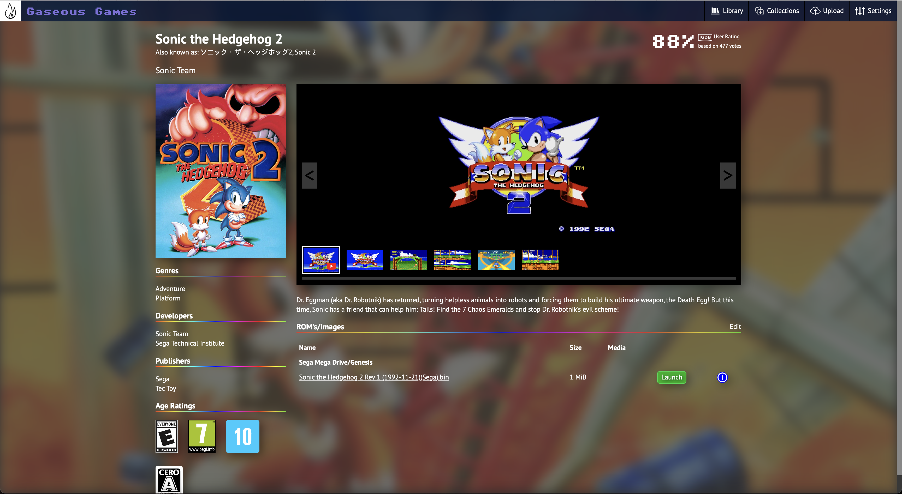

# Gaseous Server

This is the server for the Gaseous system. All your games and metadata are stored within.

## Screenshots



## Requirements
* MySQL Server 8+
* Internet Game Database API Key. See: https://api-docs.igdb.com/#account-creation

## Third Party Projects
The following projects are used by Gaseous
* https://dotnet.microsoft.com/en-us/apps/aspnet
* https://github.com/JamesNK/Newtonsoft.Json
* https://www.nuget.org/packages/MySql.Data/8.0.32.1
* https://github.com/kamranayub/igdb-dotnet
* https://github.com/EmulatorJS/EmulatorJS

## Configuration File
When Gaseous-Server is started for the first time, it creates a configuration file at ~/.gaseous-server/config.json if it doesn't exist. Some values can be filled in using environment variables (such as in the case of using docker).

### DatabaseConfiguration
| Attribute | Environment Variable |
| --------- | -------------------- |
| HostName  | dbhost               |
| UserName  | dbuser               |
| Password  | dbpass               |

### IGDBConfiguration
| Attribute | Environment Variable |
| --------- | -------------------- |
| ClientId  | igdbclientid         |
| Secret.   | igdbclientsecret     |

### config.json
```json
{
  "DatabaseConfiguration": {
    "HostName": "localhost",
    "UserName": "gaseous",
    "Password": "gaseous",
    "DatabaseName": "gaseous",
    "Port": 3306
  },
  "IGDBConfiguration": {
    "ClientId": "<clientid>",
    "Secret": "<secret>"
  },
  "LoggingConfiguration": {
    "DebugLogging": false,
    "LogFormat": "text"
  }
}

```

## Deploy with Docker
Dockerfile and docker-compose.yml files have been provided to make deployment of the server as easy as possible.
1. Download the docker-compose.yml file
2. Open the docker-compose.yml file and edit the igdbclientid and igdbclientsecret to the values retrieved from your IGDB account
3. Run the command "docker-compose up -d"
4. Connect to the host on port 5198

## Build and Deploy with Docker
Dockerfile and docker-compose-build.yml files have been provided to make deployment of the server as easy as possible.
1. Clone the repo with "git clone https://github.com/gaseous-project/gaseous-server.git"
2. Change into the gaseous-server directory
3. Open the docker-compose-build.yml file and edit the igdbclientid and igdbclientsecret to the values retrieved from your IGDB account
4. Run the command "docker-compose up --file docker-compose-build.yml -d"
5. Connect to the host on port 5198

## Adding Content
While games can be added to the server without them, it is recommended adding some signature DAT files beforehand to allow for better matching of ROM to game.

These signature DAT files contain a list of titles with hashes for many of the ROM images that have been found by the community.

Currently only TOSEC is supported, though more will be added.

### Adding signature DAT files
1. Download the DAT files from the source website. For example; from https://www.tosecdev.org/downloads/category/56-2023-01-23
2. Extract the archive
3. Copy the DAT files to ~/.gaseous-server/Data/Signatures/TOSEC/

### Adding game image files
1. Ensure your game image file is unzipped, and clearly named. Attempting a search for the game name on https://www.igdb.com can help with file naming. If a hash search is unsuccessful, Gaseous will fall back to attempting to search by the file name.
2. Copy the file to ~/.gaseous-server/Data/Import

Image to game matching follows the following order of operations, stopping the process at the first match:
### Get the file signature
1. Attempt a hash search
2. Attempt to search the signature database for a rom matching the file name - sometimes the hash can not be matched as a highscore table for example was saved to the image
3. Attempt to parse the file name - clues such as the extension being used to define which platform the file belongs to are used to create a search criteria

### Create a list of search candidates
Before beginning, remove any version numbers.
1. Add the full name of the image
2. Add the name of the image with any " - " replaced by ": "
3. Add the name of the image with text after a " - " removed
4. Add the name of the image with text after a ": " removed

### Search IGDB for a game match
Loop through each of the search candidates searching using:
1. "where" - exact match as the search candidate
2. "wherefuzzy" - partial match using wildcards
3. "search" - uses a more flexible search method

Note: that if more than one result is found, the image will be set as "Unknown" as there is no way for Gaseous to know which title is the correct one.
