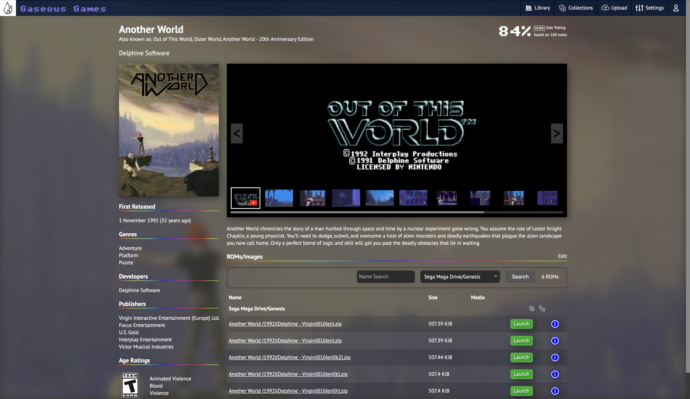
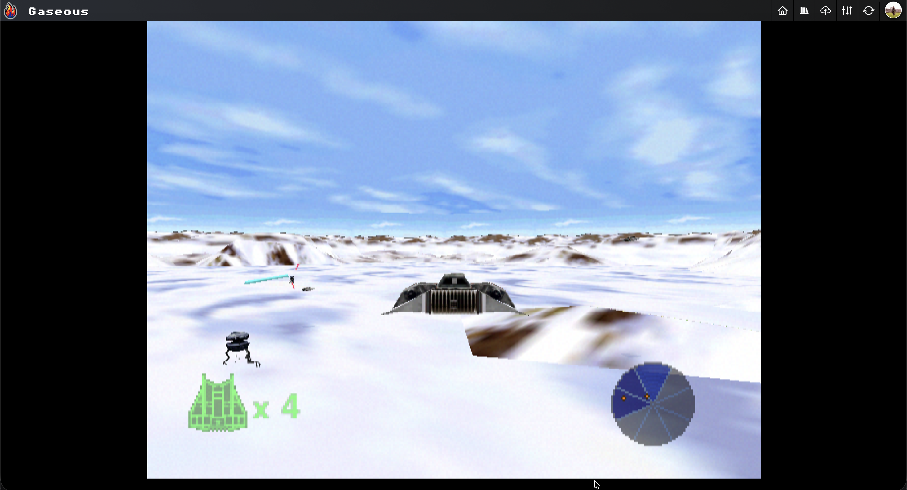

  
# Gaseous Server

This is the server for the Gaseous system. It offers ROM and title management, as well as some basic in browser emulation of those ROMs.

## Warning

Versions 1.6.1 and earlier are not suitable for being exposed to the internet, as:
1. there is no authentication support, meaning anyone could trash your library
2. the server has not been hardened for exposure to the internet - so there maybe unknown vulnerabilities

If you expose one of these earlier versions of the server to the internet, **you do so at your own risk**.

Version 1.7.0 and later contain user authentication, and can be exposed to the internet. However, it is recommended to no expose the server to the internet if you're not actively using it remotely, or if you have alternative means to access it remotely like a VPN.

While we do our best to stay on top of server security, if you expose the server to the internet **you do so at your own risk**.

## Screenshots

## Requirements
* MariaDB 11.1.2 (preferred) or MySQL Server 8+
  * These are the database versions Gaseous has been tested and developed against. Your mileage may vary with earlier versions.
  * MariaDB is the preferred database server, while MySQL will continue to be supported for existing users (they should be interchangable).
  * Note that due to the earlier database schema using MySQL specific features, moving to MariaDB from MySQL will require rebuilding your database from scratch. The "Library Scan" background task can be used to re-import all titles.
* Internet Game Database API Key. See: https://api-docs.igdb.com/#account-creation

If using the provided docker-compose.yml, MariaDB will be installed for you.

## Friends of Gaseous
* [EmulatorJS](https://github.com/EmulatorJS/EmulatorJS): A fantastic (and fast) Javascript based implementation of RetroArch, supporting a wide variety of platforms. Discord: https://discord.gg/6akryGkETU
* [RomM](https://github.com/zurdi15/romm): Another self hosted ROM manager. Discord: https://discord.gg/P5HtHnhUDH

## Third Party Projects
The following projects are used by Gaseous
* [ASP.NET](https://dotnet.microsoft.com/en-us/apps/aspnet)
* [Newtonsoft.Json](https://github.com/JamesNK/Newtonsoft.Json)
* [MySQLConnector](https://mysqlconnector.net)
* [IGDB-DOTNET](https://github.com/kamranayub/igdb-dotnet)
* [EmulatorJS](https://github.com/EmulatorJS/EmulatorJS)

## Discord Server

# Installation
See https://github.com/gaseous-project/gaseous-server/wiki/Installation for installation instructions.

# Adding Content
1. Import signatures: see https://github.com/gaseous-project/gaseous-server/wiki/Signatures
2. Add ROMs: see https://github.com/gaseous-project/gaseous-server/wiki/Adding-ROMs
