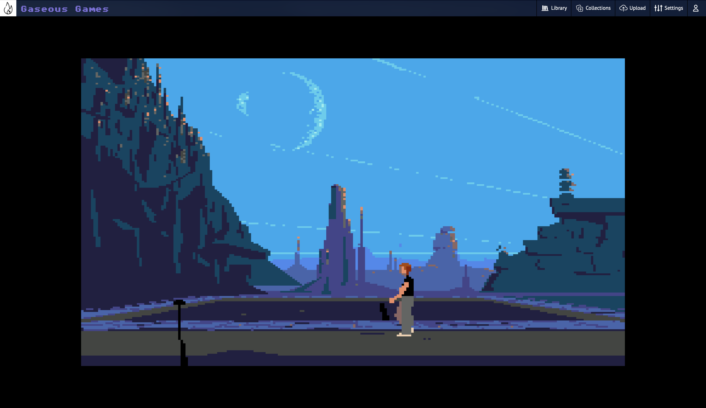

# Gaseous Server

This is the server for the Gaseous system. It offers ROM and title management, as well as some basic in browser emulation of those ROMs.

## Warning

This project is currently not suitable for being exposed to the internet.
1. there is currently no authentication support, meaning anyone could trash your library
2. the server has not been hardened for exposure to the internet - so there maybe unknown vulnerabilities

If you expose the server to the internet, **you do so at your own risk**.

## Screenshots




## Requirements
* MariaDB 11.1.2 or MySQL Server 8+
  * These are the database versions Gaseous has been tested and developed against. Your mileage may vary with earlier versions.
  * Currently MariaDB is the preferred database server, while MySQL will continue to be supported for existing users (they should be interchangable).
  * Note that due to the earlier database schema using MySQL specific features, moving to MariaDB from MySQL will require rebuilding your database from scratch. The "Library Scan" background task can be used to re-import all titles.
* Internet Game Database API Key. See: https://api-docs.igdb.com/#account-creation

## Third Party Projects
The following projects are used by Gaseous
* https://dotnet.microsoft.com/en-us/apps/aspnet
* https://github.com/JamesNK/Newtonsoft.Json
* https://www.nuget.org/packages/MySql.Data/8.0.32.1
* https://github.com/kamranayub/igdb-dotnet
* https://github.com/EmulatorJS/EmulatorJS

## Discord Server
[](https://discord.gg/Nhu7wpT3k4)

# Setup

## Configuration File
When Gaseous-Server is started for the first time, it creates a configuration file at ~/.gaseous-server/config.json if it doesn't exist. Some values can be filled in using environment variables (such as in the case of using docker).

### DatabaseConfiguration
| Attribute | Environment Variable |
| --------- | -------------------- |
| HostName  | dbhost               |
| UserName  | dbuser               |
| Password  | dbpass               |

### IGDBConfiguration
| Attribute | Environment Variable |
| --------- | -------------------- |
| ClientId  | igdbclientid         |
| Secret.   | igdbclientsecret     |

### config.json
```json
{
  "DatabaseConfiguration": {
    "HostName": "localhost",
    "UserName": "gaseous",
    "Password": "gaseous",
    "DatabaseName": "gaseous",
    "Port": 3306
  },
  "IGDBConfiguration": {
    "ClientId": "<clientid>",
    "Secret": "<secret>"
  },
  "LoggingConfiguration": {
    "DebugLogging": false,
    "LogRetention": 7
  }
}

```

# Installation
See https://github.com/gaseous-project/gaseous-server/wiki/Installation for installation instructions.

# Adding Content
While games can be added to the server without them, it is recommended adding some signature DAT files beforehand to allow for better matching of ROMs to games.

These signature DAT files contain a list of titles with hashes for many of the ROM images that have been found by the community.

Currently supported DAT's:
* TOSEC: https://www.tosecdev.org/downloads/category/56-2023-01-23
* MAME Arcade and MAME Mess: https://www.progettosnaps.net/dats/MAME

If there are other DAT's you'd like to see support for, please raise an issue with a link to the DAT's.

## Adding signature DAT files
### TOSEC
1. Download the DAT files from the source website. For example; from https://www.tosecdev.org/downloads/category/56-2023-01-23
2. Extract the archive
3. Copy the DAT files to ~/.gaseous-server/Data/Signatures/TOSEC/

### MAME Arcade
1. Download the DAT files from the source website. For example; from https://www.progettosnaps.net/dats/MAME
2. Extract the archive
3. Copy the file name "MAME 0.257 (arcade).dat" files to ~/.gaseous-server/Data/Signatures/MAME Arcade/

### MAME MESS
1. Download the DAT files from the source website. For example; from https://www.progettosnaps.net/dats/MAME
2. Extract the archive
3. Copy the file name "MAME 0.257 (mess).dat" files to ~/.gaseous-server/Data/Signatures/MAME MESS/

# Adding Game Images
1. Files can be presented as either stand alone files, or as zip files - currently 7z is unsupported.
2. Name the file appropriately.
   * Attempting a search for the game name on https://www.igdb.com can help with file naming. If a hash search is unsuccessful, Gaseous will fall back to attempting to search by the file name.
3. Add the file to the server:
   * Click the Upload button in the top right of the main Gaseous web page, and drag the files into the modal. The files will be uploaded and analyzed.
   * Copy the file to ~/.gaseous-server/Data/Import

# Game Image Title Matching
Image to game matching follows the following order of operations, stopping the process at the first match:
### Get the file signature
1. Attempt a hash search
2. Attempt to search the signature database for a rom matching the file name - sometimes the hash can not be matched as a highscore table for example was saved to the image
3. Attempt to parse the file name - clues such as the extension being used to define which platform the file belongs to are used to create a search criteria

**Note**: If the file being scanned is a zip, the file will be extracted and searched. The first file whose signature can be found will be used to match the entire zip archive - be sure that the zip only contains files related to one game.

### Create a list of search candidates
Before beginning, remove any version numbers, and anything in the search string that is between ()
1. Add the full name of the image
2. Add the name of the image with any " - " replaced by ": "
3. Add the name of the image with text after a " - " removed
4. Add the name of the image with text after a ": " removed

### Search IGDB for a game match
Loop through each of the search candidates searching using:
1. "where" - exact match as the search candidate
2. "wherefuzzy" - partial match using wildcards
3. "search" - uses a more flexible search method
4. "searchNoPlatform" - uses the "search" method, but does not constrain the search to the determined platform

**Note**: If more than one result is found, the seach will loop through the returned results:
* If an exact (case-insensitive) match is found, that result is used for the match
* If still no match, the image will be set as "Unknown" as there is no way for Gaseous to know which title is the correct one.
